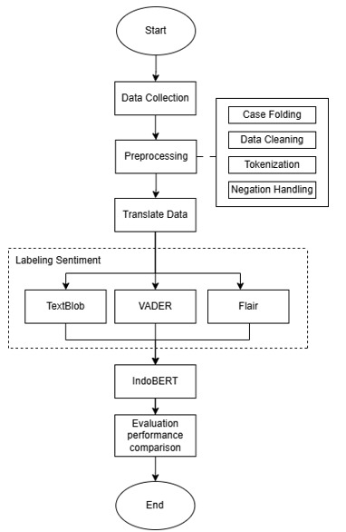

# Sentiment Analysis Research: 
## COMPARISON OF SENTIMENT LABELING USING TEXTBLOB, VADER, AND FLAIR IN PUBLIC OPINION ANALYSIS POST-2024 PRESIDENTIAL INAUGURATION WITH INDOBERT

Welcome to the research repository on **Comparing Sentiment Labeling in Post-Inauguration Sentiment Analysis 2024**. This study aims to analyze public opinion through sentiment analysis on text data taken from social media platforms, **X**, **YouTube**, and **Instagram**. This study compares sentiment labeling techniques using [TextBlob](https://textblob.readthedocs.io/en/dev/), [VADER](https://pypi.org/project/vaderSentiment/), and [Flair](https://github.com/flairNLP/flair), and then tested the results using the [IndoBERT](https://indolem.github.io/IndoBERT/) model to determine the most effective sentiment labeling method.

## 🎯 Project Objective

This study aims to **analyze public opinion**, **compare the results and performance of each labeling technique**, and apply the **IndoBERT model in training and testing**. This study is expected to provide an overview of the selection of labeling techniques for **sentiment analysis**.

The specific objectives of this study are:
1. **Analyze Public Opinion Post-Inauguration of the 2024 President** 
Analyze public reaction using sentiment analysis from social media data.

2. **Compare Sentiment Labeling Techniques** 
Comparing the effectiveness of three sentiment labeling techniques, namely [TextBlob](https://textblob.readthedocs.io/en/dev/), [VADER](https://pypi.org/project/vaderSentiment/), and [Flair](https://github.com/flairNLP/flair), in analyzing sentiment from social media texts.

3. **Apply the [IndoBERT](https://indolem.github.io/IndoBERT/) Model for Sentiment Labeling Evaluation** 
Use the [IndoBERT](https://indolem.github.io/IndoBERT/) model, a deep learning-based model, to train and test the sentiment labeling results of the three techniques, and compare the accuracy of each technique in public opinion analysis.

4. **Assessing the Accuracy and Effectiveness of Sentiment Labeling** 
Assess the accuracy of sentiment labeling using [TextBlob](https://textblob.readthedocs.io/en/dev/), [VADER](https://pypi.org/project/vaderSentiment/), and [Flair](https://github.com/flairNLP/flair), and determine the most effective labeling technique based on the results of testing with the [IndoBERT](https://indolem.github.io/IndoBERT/) model.

   
## 🧑‍💻 Methodology

### 🖼️ Flowchart of Research
 

  

 

This study involves several main steps in data analysis:

1. ### **Data Collection**: 
    - The dataset was collected from social media platforms, **X**, **YouTube**, and **Instagram**, consisting of 5,283 data. The data used were in the form of text from tweets and comments.
     - **Data Format**: Data in the form of text in CSV (Comma Separated Values) format.

2. ### **Data Preprocessing**: 
    - Before the data is used for model training, several preprocessing stages are carried out to ensure optimal data quality.
The preprocessing steps include:
    - **Case Folding**: Change all text to lowercase.
    - **Data Cleaning**: reduce noise such as mentions (@username), numbers, links, punctuation marks, symbols, and other characters that need to be removed.
    - **Tokenization**: Break text into words or tokens.
    - **Negation Handling**: identify and manage negations in sentences.

3. **Translation**
    - Translation of data from **Indonesian** to **English** because [TextBlob](https://textblob.readthedocs.io/en/dev/), [VADER](https://pypi.org/project/vaderSentiment/), and [Flair](https://github.com/flairNLP/flair) are accurate in **English** text.

4. **Modeling**:
    - This study uses the [IndoBERT](https://indolem.github.io/IndoBERT/) model for training and testing labeling results.

5. **Model Evaluation**:
    - The evaluation was carried out using the following metrics:
    - **Accuracy**: Measures how well the model correctly classifies text.
    - **Precision and Recall**: Used to assess the model's performance in detecting sentiment.
    - **F1-Score**: Assesses the balance between precision and recall.

## 📫 **How to reach me**:
- **Email**: khoerulanam231@gmail.com
- **LinkedIn**: [khoerul-anam](https://www.linkedin.com/in/khoerul-anam-a7b627221/)
